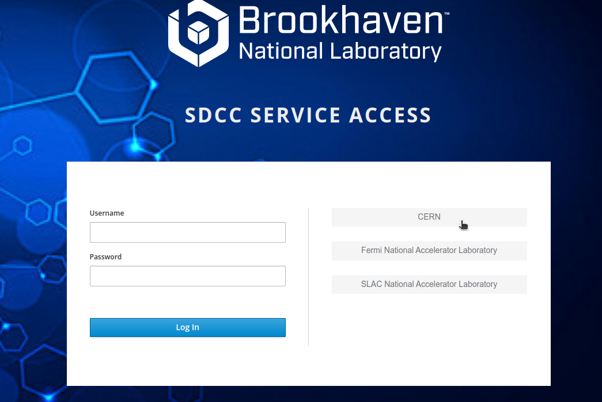
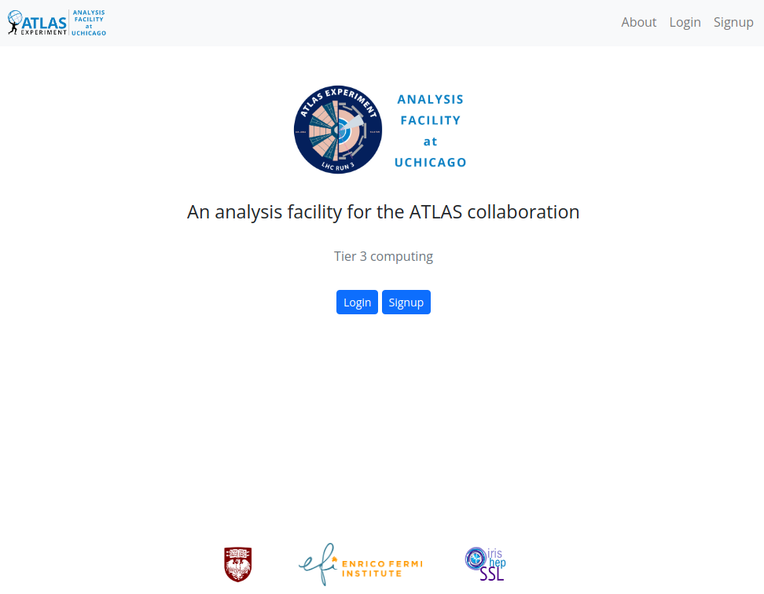
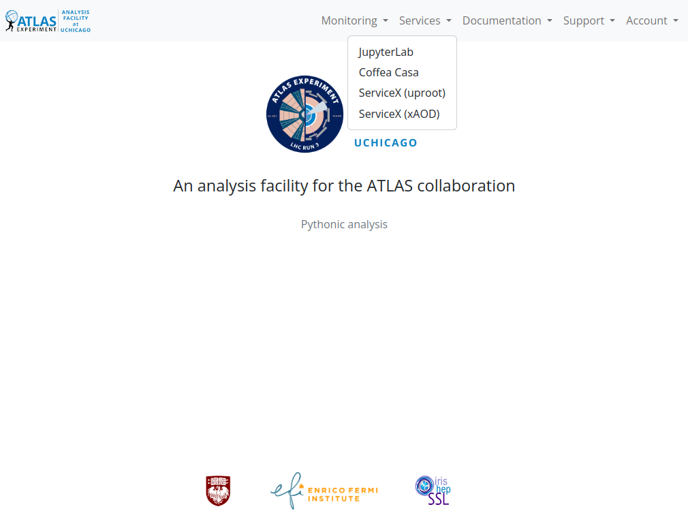
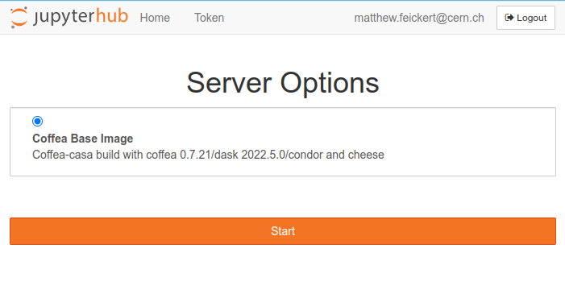
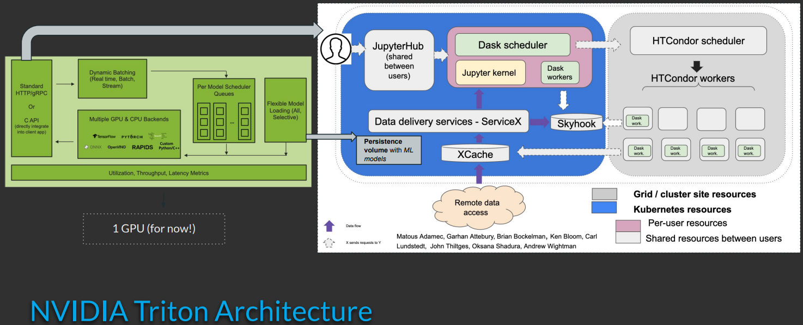
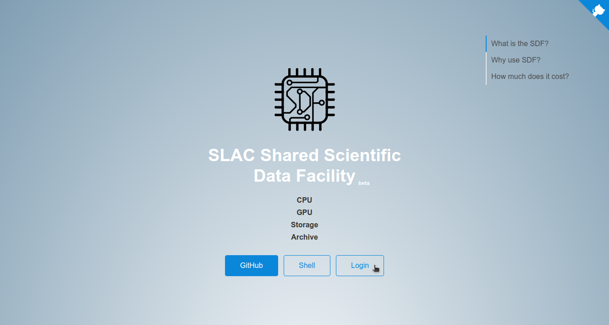
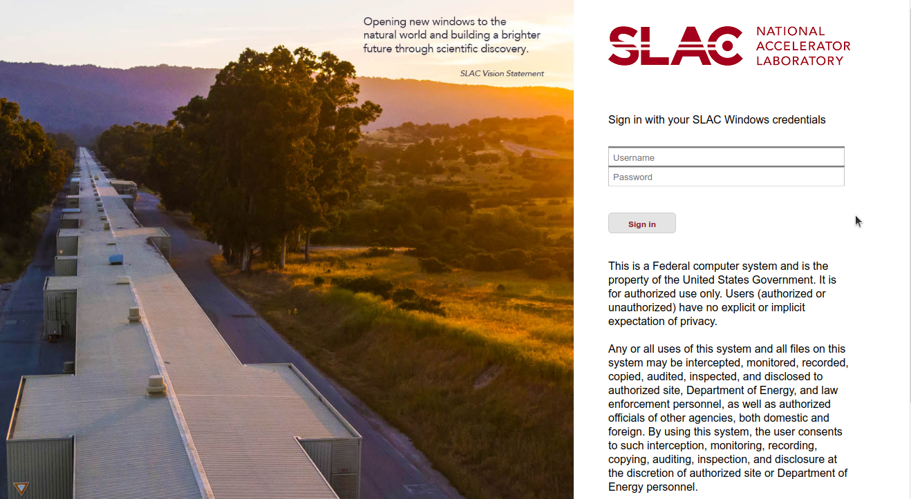
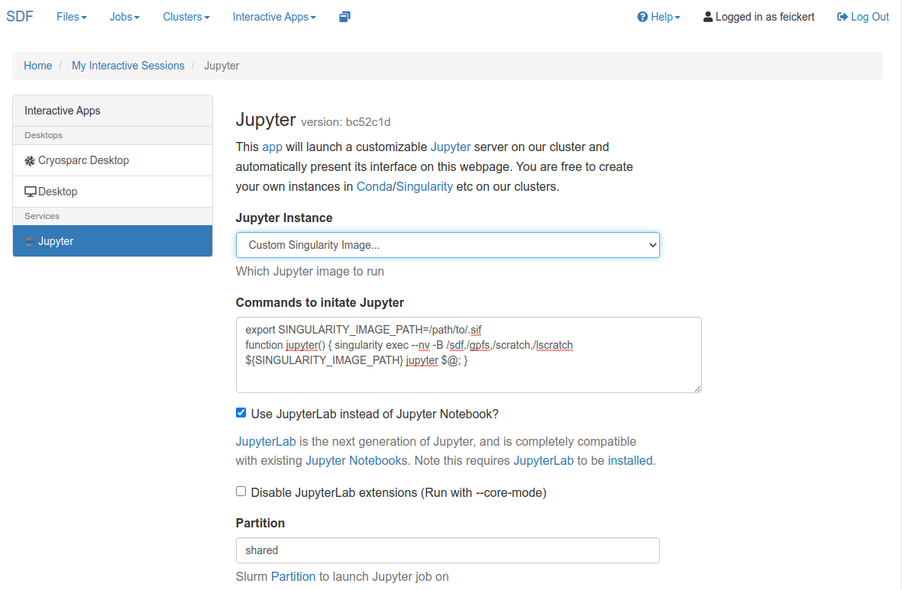

class: middle, center, title-slide
count: false

# IRIS-HEP Analysis Grand Challenge<br> at US ATLAS Analysis Facilities
.large.blue[Matthew Feickert]<br>
.large[(University of Wisconsin-Madison)]
<br>
[matthew.feickert@cern.ch](mailto:matthew.feickert@cern.ch)

[IRIS-HEP AGC workshop 2023](https://indico.cern.ch/event/1260431/contributions/5315256/)

May 4th, 2023

.middle-logo[]

---
# Thanks where it is due

Most of this information is my view of the abundant information and fantastic work done by the people leading the US ATLAS Analysis Facility efforts. Any errors are mine and all success is theirs. Thanks to them and to the following people for their feedback on this talk!

* Doug Benjamin (BNL)
* Ofer Rind (BNL)
* Shuwei Ye (BNL)
* Rob Gardner (UChiacgo)
* Ilija Vukotic (UChicago)
* Fengping Hu (UChicago)
* Lincoln Bryant (UChicago)
* Wei Yang (SLAC)

---
# Analysis Facilities

<br>
.large[
.center.huge.bold[What is an Analysis Facility (AF)?]

Taking the [HSF Analysis Facilities Forum](https://hepsoftwarefoundation.org/activities/analysisfacilitiesforum.html)'s definition:

.italic[The .bold[infrastructure and services] that provide .bold[integrated data, software and computational resources] to execute one or more elements of an analysis workflow. These resources are .bold[shared] among members of a virtual organization and .bold[supported by that organization].]

<br>
We also had lots of discussion about this at the [2020 Future Analysis Systems and Facilities IRIS-HEP Blueprint workshop](https://indico.cern.ch/event/960587/).

<br>
Already covered this today in AGC [German facilities](https://indico.cern.ch/event/1260431/timetable/?view=standard#18-experience-with-agc-at-germ) (David Koch) and [US CMS Analysis Facilities](https://indico.cern.ch/event/1260431/timetable/?view=standard#19-agc-at-us-cms-afs) (Carl Lundstedt) talks.
]

---
# US ATLAS Analysis Facilities

.grid[
.center.kol-1-3[
<br>
.width-100[[](https://atlas-jupyter.sdcc.bnl.gov/)]

<br><br>
.large[Brookaven National Lab Scientific Data and Computing Center (SDCC)]
]
.center.kol-1-3[
.width-100[[](https://af.uchicago.edu/)]

.large[University of Chicago]
]
.center.kol-1-3[
.width-65[[](https://sdf.slac.stanford.edu/)]

.large[SLAC National Lab Shared Scientific Data Facility (SDF)]
]
]

___

.grid[
.kol-1-3[
* Shared .bold[Tier 3] computing spaces
   - Interactive and batch computing
   - ATLAS data storage
   - Computing and analysis tutorials
]
.kol-1-3[
* .bold[Heterogenous compute] resources
   - x86-64 and AArch64
   - Access to GPUs
   - Machine learning resources
]
.kol-1-3[
* Centers for .bold[software and computing experimentation]
   - Each AF has unique features and capabilities
]
]

---
# US ATLAS Analysis Facilities

.grid[
.center.kol-1-3[
<br>
.width-100[[](https://atlas-jupyter.sdcc.bnl.gov/)]

<br><br>
.large[Brookaven National Lab Scientific Data and Computing Center (SDCC)]
]
.center.kol-1-3[
.width-100[[](https://af.uchicago.edu/)]

.large[University of Chicago]
]
.center.kol-1-3[
.width-65[[](https://sdf.slac.stanford.edu/)]

.large[SLAC National Lab Shared Scientific Data Facility (SDF)]
]
]

<br>
.center.large[📖 Check out the [US ATLAS Analysis Facilities ReadTheDocs](https://usatlas.readthedocs.io/projects/af-docs/)]
.center.large[❓ Ask questions on the [ATLAS Analysis Facilities Discourse Forum](https://atlas-talk.sdcc.bnl.gov/)]

---
# BNL SDCC AF: Resources &nbsp;&nbsp;&nbsp; .width-15[[](https://atlas-jupyter.sdcc.bnl.gov/)]

<br>

.large.grid[
.kol-1-3[
.center.bold[[Compute resources](https://indico.cern.ch/event/1078853/contributions/4569995/)]
* ~2,200 HTC nodes<br>(burst up to 22,000 cores)
* Supporting 5 HPC clusters
* HTCondor batch system on HTC nodes
* (ATLAS Tier 1 farm completely separate resource)
]
.kol-1-3[
.center.bold[Jupyter access]
* SDCC Analysis Portal to JupyterHub instance
* Runs on 4 VMs (per VM: 16 cores, 48 GB RAM)
* Able to scale out jobs with HTCondor
* GPU accessible on shared pool
]
.kol-1-3[
.center.bold[Container infrastructure]
* Apptainer/Singularity with the ability to .bold[pull custom images]
* [OKD](https://docs.okd.io/) for container orchestration
]
]

---
# BNL SDCC AF: AGC Workflow &nbsp;&nbsp;&nbsp; .width-15[[](https://atlas-jupyter.sdcc.bnl.gov/)]

.center.width-70[[](https://atlas-jupyter-test.sdcc.bnl.gov/)]

.huge.center[SDCC login with federated authentication]

---
# SDCC Jupyter Launcher: AGC Workflow &nbsp;&nbsp;&nbsp; .width-15[[](https://atlas-jupyter.sdcc.bnl.gov/)]

.center.width-90[[](https://atlas-jupyter-test.sdcc.bnl.gov/)]

.huge.center[Allows for running .bold[custom images] as Apptainer containers]
.huge.center[Can pull from public image registries or from CVMFS unpacked]

---
# SDCC Jupyter Launcher: AGC Workflow &nbsp;&nbsp;&nbsp; .width-15[[](https://atlas-jupyter.sdcc.bnl.gov/)]

.center.width-100[[](https://atlas-jupyter-test.sdcc.bnl.gov/)]

.center.huge.bold[Example:]
.huge.bold[`/cvmfs/unpacked.cern.ch/hub.opensciencegrid.org/iris-hep/analysis-systems-base:2022-12-15`]

---
# Development image: analysis-systems-base

.kol-1-2.huge[
- As we can use custom images at BNL created the `analysis-systems-base` image (https://github.com/iris-hep/analysis-systems-base)
- Images are hosted on [OSG Harbor](https://hub.opensciencegrid.org/harbor/projects/863/repositories/analysis-systems-base) under `iris-hep` org
   - `hub.opensciencegrid.org/iris-hep/analysis-systems-base`
   - Thanks Brian Lin for making this happen!
]
.kol-1-2[
.center.width-100[[](https://github.com/iris-hep/analysis-systems-base)]
]

---
# Custom kernel discovery (WIP) &nbsp;&nbsp;&nbsp; .width-15[[](https://atlas-jupyter.sdcc.bnl.gov/)]

.center.width-75[[](https://atlas-jupyter-test.sdcc.bnl.gov/)]

.large[At the moment, lacking mounting (or something else) to automatically discover and mount custom kernels from user defined virtual environments]

---
# Custom kernel discovery &nbsp;&nbsp;&nbsp; .width-15[[](https://atlas-jupyter.sdcc.bnl.gov/)]

.bold[
```
Singularity> mkdir -p ~/.local/share/jupyter/kernels
Singularity> ln --symbolic \
   /opt/micromamba/envs/analysis-systems/share/jupyter/kernels/analysis-systems \
   ~/.local/share/jupyter/kernels
Singularity>
```
]

<br>
.center.huge.bold[Workaround: Create custom symlink first time]
.center.huge.bold[(c.f. https://github.com/iris-hep/analysis-systems-base/issues/12)]

---
# Custom kernel discovery &nbsp;&nbsp;&nbsp; .width-15[[](https://atlas-jupyter.sdcc.bnl.gov/)]

.center.width-75[[](https://atlas-jupyter-test.sdcc.bnl.gov/)]

.center.huge.bold[Workaround: Create custom symlink first time]
.center.huge.bold[(c.f. https://github.com/iris-hep/analysis-systems-base/issues/12)]

---
# Example: [AGC CMS Open Data $t\bar{t}$ Analysis](https://github.com/iris-hep/analysis-grand-challenge/blob/v1.0.0/analyses/cms-open-data-ttbar/ttbar_analysis_pipeline.ipynb)

.huge[
- Doug has moved data to `/usatlas/atlas01/atlasdisk/users/benjamin/AGC/`
- Notebook (was) running end-to-end 🚀
   - I'm pretty sure this is just that I need to update a few things on my fork
- BNL is not a Coffea-casa AF (uses ODK), so use global config
```python
...
USE_DASK = True  # enable Dask
AF = "local"  # local setup, not coffea-casa
AF_NAME = "bnl"  # Added on Matthew's fork
...
```
]

---
# UChicago AF: [Resources](https://af.uchicago.edu/hardware) &nbsp;&nbsp;&nbsp; .width-10[[](https://af.uchicago.edu/)]

.grid[
.kol-1-3[
.center.bold[Compute resources]
* CPUs:
   - 1,520 cores (long queue)
   - 1,280 cores (short queue)
* GPUs:
   - Two NVIDIA A100 nodes
   - A few NVIDIA 1080 and 2080 nodes
* HTCondor batch system with autoscaling (developed by [Brian Bockleman](https://github.com/opensciencegrid/htcondor-autoscale-manager))
]
.large.kol-1-3[
.center.bold[Jupyter access]
* Analysis Portal to JupyterHub instance
* JupyterLab offers interactive access to GPUs with selection of NVIDIA enabled Docker images
* .bold[Coffea-casa instance]
]
.large.kol-1-3[
.center.bold[Container infrastructure ]
* Uses Kubernetes for container orchestration so supports Coffea-casa
* Two ServiceX instances
]
]

___

.center.large[For more detailed summary c.f. [Fengping Hu's 2022 US ATLAS Budget Scrubbing talk](https://indico.cern.ch/event/1167456/contributions/4966544/)]

---
# UChicago AF: AGC Workflow &nbsp;&nbsp;&nbsp; .width-10[[](https://af.uchicago.edu/)]

.center.width-60[[](https://af.uchicago.edu/)]

.center.large[Login with Globus CILogon]

---
# UChicago AF: AGC Workflow &nbsp;&nbsp;&nbsp; .width-10[[](https://af.uchicago.edu/)]

.center.width-60[[](https://af.uchicago.edu/)]

.center.large[Able to launch Coffe-casa]

---
# UChicago AF: AGC Workflow &nbsp;&nbsp;&nbsp; .width-10[[](https://af.uchicago.edu/)]

.center.width-70[[](https://af.uchicago.edu/)]

.center.large[Use the latest coffea-casa release deployed by DOMA]

---
# Example: [AGC Example Analyses](https://github.com/iris-hep/analysis-grand-challenge/blob/v1.0.0/analyses/)

.huge.bold[[AGC CMS Open Data $t\bar{t}$ Analysis](https://github.com/iris-hep/analysis-grand-challenge/blob/v1.0.0/analyses/cms-open-data-ttbar/ttbar_analysis_pipeline.ipynb)]

.huge[
* Analysis runs end-to-end out of the box 🚀
* Won't compare runtime given recent issues around HTTP and XRootD
   - [github.com/iris-hep/analysis-grand-challenge/ Issue #128](https://github.com/iris-hep/analysis-grand-challenge/issues/128)
]

.huge.bold[[AGC ATLAS Open Data $H\rightarrow ZZ^\star$ Analysis](https://github.com/iris-hep/analysis-grand-challenge/blob/v1.0.0/analyses/atlas-open-data-hzz/HZZ_analysis_pipeline.ipynb)]

.huge[
* Analysis runs end-to-end out of the box 🚀
   - Modulo [github.com/CoffeaTeam/coffea-casa/ Issue #379](https://github.com/CoffeaTeam/coffea-casa/issues/379)
]

---
# UChicago AF: [Triton Inference Server](https://github.com/maniaclab/triton-inference-server) &nbsp;&nbsp;&nbsp; .width-10[[](https://af.uchicago.edu/)]

.large.kol-1-3[
* Each Triton pod requests 1 GPU and additional Triton pods created in response to load
   - GPUs selected from [any available](https://af.uchicago.edu/hardware)
* Available within Kubernetes (Coffea-casa), Jupyter Hub
* Setup to use Amazon S3 object store for model registry
   - Though S3 bucket is shared
]
.large.kol-2-3[
<br>
<br>
.center.width-100[[](https://indico.cern.ch/event/1260431/contributions/5315191/)]

.center[Elliott Kauffman, 2023 IRIS-HEP AGC Workshop]
]

---
# SLAC SDF AF: Resources &nbsp;&nbsp;&nbsp; .width-5[[](https://sdf.slac.stanford.edu/)]

.large.grid[
.kol-1-3[
.center.bold[Compute resources]
* CPUs: ~1,200 cores
* GPUs:
   - 80 NVIDIA A100
   - 350+  older NVIDIA models
* SLURM batch system
]
.kol-1-3[
.center.bold[Jupyter access]
* SDF website to JupyterHub instance
* JupyterLab offers interactive access to GPUs with selection of NVIDIA enabled Singularity images
]
.kol-1-3[
.center.bold[Container infrastructure]
* Uses [vcluster](https://github.com/loft-sh/vcluster) (Kubernetes) for container orchestration
* Vera C. Rubin cluster should have large pool of k8
]
]

---
# SLAC SDF AF: AGC Workflow &nbsp;&nbsp;&nbsp; .width-5[[](https://sdf.slac.stanford.edu/)]

.center.width-80[[](https://sdf.slac.stanford.edu/)]

.center.large[Login via SLAC SDF webpage]

---
# SLAC SDF AF: AGC Workflow &nbsp;&nbsp;&nbsp; .width-5[[](https://sdf.slac.stanford.edu/)]

.center.width-80[[](https://sdf.slac.stanford.edu/public/doc/#/accounts-and-access?id=accounts-and-access)]

.center.large[SLAC ID and Windows Active Directory required for authentication]

---
# SLAC SDF AF: AGC Workflow &nbsp;&nbsp;&nbsp; .width-5[[](https://sdf.slac.stanford.edu/)]

```console
[feickert@sdf-login03 ~]$ export _DIR=/scratch/${USER}/.singularity
[feickert@sdf-login03 ~]$ mkdir -p "${_DIR}"
[feickert@sdf-login03 ~]$ export SINGULARITY_LOCALCACHEDIR="${_DIR}"
[feickert@sdf-login03 ~]$ export SINGULARITY_CACHEDIR="${_DIR}"
[feickert@sdf-login03 ~]$ export SINGULARITY_TMPDIR="${_DIR}"
[feickert@sdf-login03 ~]$ singularity pull \
   docker://hub.opensciencegrid.org/iris-hep/analysis-systems-base:2022-12-15
```

.center.large[[Pull custom images as Apptainer/Singularity container images](https://sdf.slac.stanford.edu/public/doc/#/software?id=singularity)]
.center.large[(very slow)]

```bash
export SINGULARITY_IMAGE_PATH=/path/to/.sif
function jupyter() {
   singularity exec --nv -B /sdf,/gpfs,/scratch,/lscratch \
   ${SINGULARITY_IMAGE_PATH} jupyter $@;
}
```

.center.large[[Set commands to paste for initiating Jupyter Hub](https://sdf.slac.stanford.edu/public/doc/#/interactive-compute?id=in-a-singularity-container)]

---
# SLAC SDF AF: AGC Workflow &nbsp;&nbsp;&nbsp; .width-5[[](https://sdf.slac.stanford.edu/)]

.center.width-80[[](https://sdf.slac.stanford.edu/public/doc/#/interactive-compute?id=in-a-singularity-container)]

---
# SLAC SDF AF: AGC Workflow &nbsp;&nbsp;&nbsp; .width-5[[](https://sdf.slac.stanford.edu/)]

.huge[
* This is as far as I have gotten
   - Currently unable to get <br>hub.opensciencegrid.org/iris-hep/analysis-systems-base:2022-12-15<br> image running
* Will need to make a new flavor that includes SLURM instead of HTCondor to be able to use SDF batch system
* Once have working interactive Jupyter session then can try to run AGC
* 💡 As SDF supports Kubernetes would be .bold[amazing if they could support Coffea-casa]
]

---
# Summary: Services at a glance

<br>
<br>
<br>

.center.large[

| AF       | | Federated Login | | Batch    | Container Orchestration | | Dask | | Jupyter Hub | | Custom Images | | Coffea-casa | | ServiceX | | GPUs | | Triton Server |
| :-       | | :-:             | | :-       | :-:        | |:-:   | | :-:      | | :-:           | | :-:         | | :-:         | | :-:      | | :-:           |
| BNL      | | ✅              | | HTCondor | OKD        | | ✅   | | ✅       | | ✅            | | ❌          | | ✅         | | ✅        | | ❌            |
| UChicago | | ✅              | | HTCondor | kubernetes | | ✅   | | ✅       | | ❌            | | ✅          | | ✅         | | ✅        | | ✅            |
| SLAC     | | ❌              | | SLURM    | kubernetes | | ✅   | | ✅       | | ✅            | | ❌          | | ❌         | | ✅        | | ❌            |

]

<br>
<br>
<br>
<br>
___

.center[More detailed analysis in [Fengping Hu's 2022 US ATLAS Computing Facilities Face-to-Face talk](https://indico.cern.ch/event/1201515/contributions/5136976/)]

---
# Summary
.large.kol-2-3[
* US ATLAS Analysis Facilities offer robust computing resources
* At differing stages of production readiness for AGC workflows and users
   - BNL: ✅ (basically, and then some UX workarounds)
   - UChicago: ✅
   - SLAC: More work to do
* Each Analysis Facility offers unique features and experimental options for exploration
   - BNL: Large pool of CPU nodes for bursting. OKD for new services (REANA, ServiceX).
   - UChicago: Coffea-casa, NVIDIA Triton server, Dask scale out to HTCondor on AF and MWT2. ServiceX instances.
   - SLAC: GPUs galore. Large k8s pool.
]
.center.kol-1-3[
.width-100[[](https://atlas-jupyter.sdcc.bnl.gov/)]
<br>
<br>
.width-100[[](https://af.uchicago.edu/)]
<br>
<br>
.width-75[[](https://sdf.slac.stanford.edu/)]
]

---
class: end-slide, center

Backup

---
# Development image: analysis-systems-base

.kol-1-2.huge[
- As we can use custom images at BNL created the `analysis-systems-base` image (https://github.com/iris-hep/analysis-systems-base)
- Goal is to use lock files to make as much of the image as fully reproducible as possible and statically defined.
]
.kol-1-2[
.center.width-70[[](https://github.com/iris-hep/analysis-systems-base)]
]

---

class: end-slide, center
count: false

The end.
