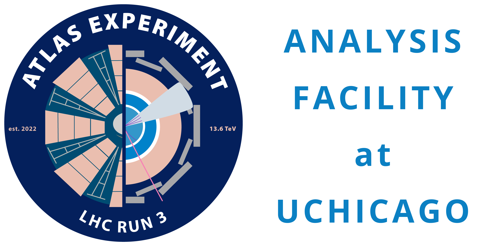
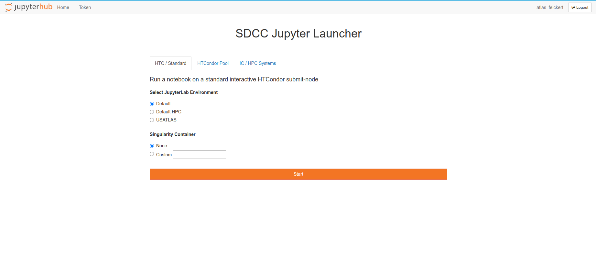
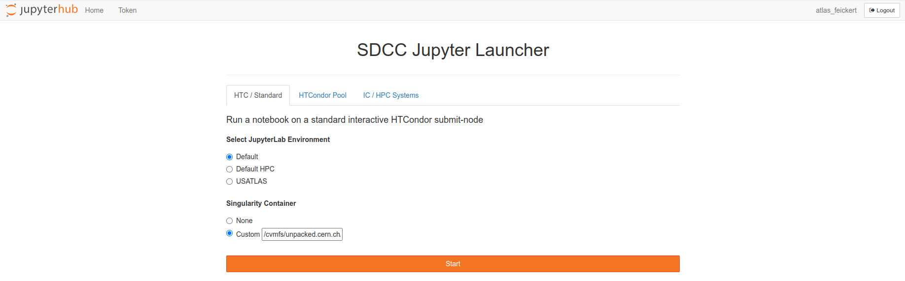
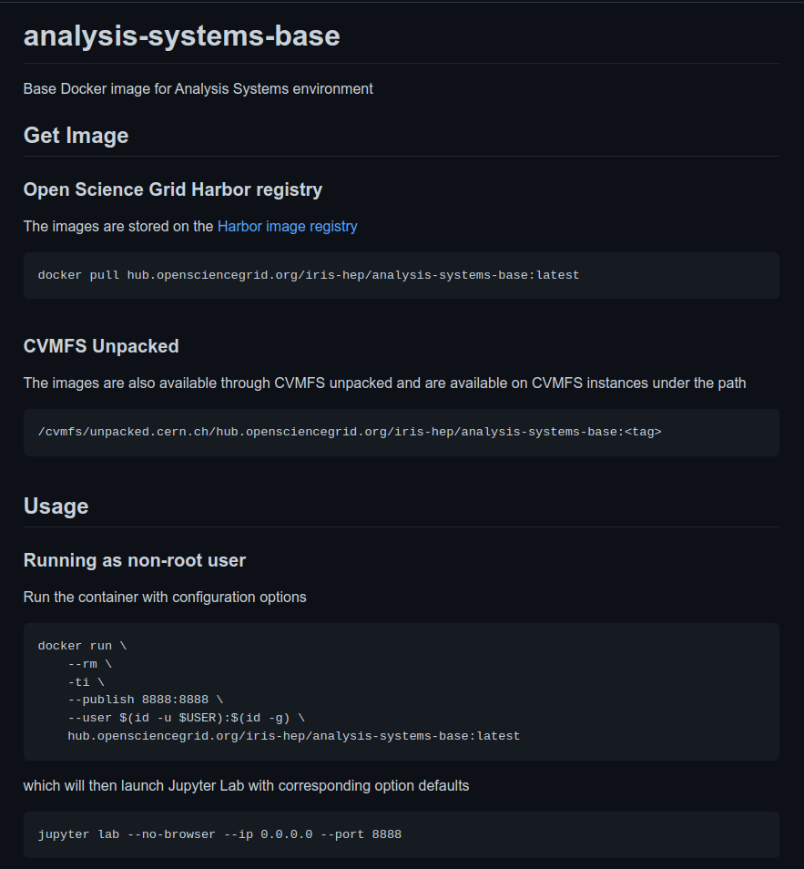
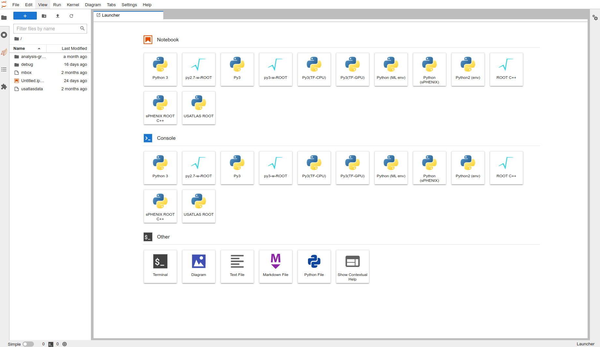
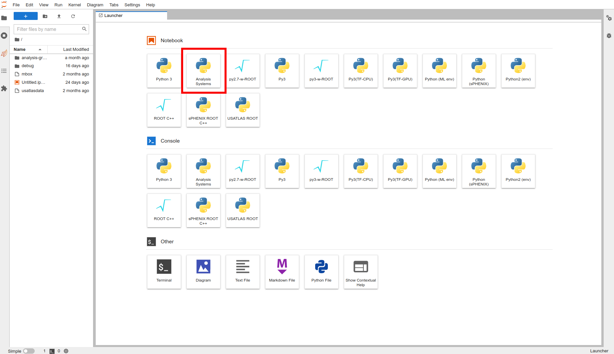
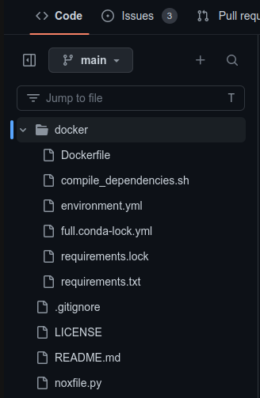

class: middle, center, title-slide
count: false

# IRIS-HEP Analysis Grand Challenge<br> at US ATLAS Analysis Facilities
.large.blue[Matthew Feickert]<br>
.large[(University of Wisconsin-Madison)]
<br>
[matthew.feickert@cern.ch](mailto:matthew.feickert@cern.ch)

[IRIS-HEP AGC workshop 2023](https://indico.cern.ch/event/1260431/contributions/5315256/)

May 4th, 2023

.middle-logo[]

---
# Talk Overview

.large[
* .bold[Time]: 20 minutes talk + 10 minutes questions
* .bold[Notes from organizers]:
   - Slides can just advertise/summarize available "features" at various facilities that could be useful for AGC style workflows.
      - Example: UChicago we have now also Triton supporting 70 GPUs
   - It would be ideal to test them also
   - Nice example to test if AGC notebook can run all the way, and if not what is missing.
]

---
# Analysis Facilities

<br>
.large[
.center.huge.bold[What is an Analysis Facility (AF)?]

Taking the [HSF Analysis Facilities Forum](https://hepsoftwarefoundation.org/activities/analysisfacilitiesforum.html)'s definition:

.italic[The .bold[infrastructure and services] that provide .bold[integrated data, software and computational resources] to execute one or more elements of an analysis workflow. These resources are .bold[shared] among members of a virtual organization and .bold[supported by that organization].]

<br>
We also had lots of discussion about this at the [2020 Future Analysis Systems and Facilities IRIS-HEP Blueprint workshop](https://indico.cern.ch/event/960587/).

<br>
Already covered this today in AGC [German facilities](https://indico.cern.ch/event/1260431/timetable/?view=standard#18-experience-with-agc-at-germ) (David Koch) and [US CMS Analysis Facilities](https://indico.cern.ch/event/1260431/timetable/?view=standard#19-agc-at-us-cms-afs) (Carl Lundstedt) talks.
]

---
# US ATLAS Analysis Facilities

.grid[
.center.kol-1-3[
<br>
.width-100[[](https://atlas-jupyter.sdcc.bnl.gov/)]

<br><br>
.large[Brookaven National Lab Scientific Data and Computing Center (SDCC)]
]
.center.kol-1-3[
.width-100[[](https://af.uchicago.edu/)]

.large[University of Chicago]
]
.center.kol-1-3[
.width-65[[](https://sdf.slac.stanford.edu/)]

.large[SLAC National Lab Shared Scientific Data Facility (SDF)]
]
]

___

.grid[
.kol-1-3[
* Shared .bold[Tier 3] computing spaces
   - Interactive and batch computing
   - ATLAS data storage
   - Computing and analysis tutorials
]
.kol-1-3[
* .bold[Heterogenous compute] resources
   - x86-64 and AArch64
   - Access to GPUs
   - Machine learning resources
]
.kol-1-3[
* Centers for .bold[software and computing experimentation]
   - Each AF has unique features and capabilities
]
]

---
# US ATLAS Analysis Facilities

.grid[
.center.kol-1-3[
<br>
.width-100[[](https://atlas-jupyter.sdcc.bnl.gov/)]

<br><br>
.large[Brookaven National Lab Scientific Data and Computing Center (SDCC)]
]
.center.kol-1-3[
.width-100[[](https://af.uchicago.edu/)]

.large[University of Chicago]
]
.center.kol-1-3[
.width-65[[](https://sdf.slac.stanford.edu/)]

.large[SLAC National Lab Shared Scientific Data Facility (SDF)]
]
]

<br>
.center.large[📖 Check out the [US ATLAS Analysis Facilities ReadTheDocs](https://usatlas.readthedocs.io/projects/af-docs/)]
.center.large[❓ Ask questions on the [ATLAS Analysis Facilities Discourse Forum](https://atlas-talk.sdcc.bnl.gov/)]

---
# BNL SDCC AF: Resources &nbsp;&nbsp;&nbsp; .width-15[[](https://atlas-jupyter.sdcc.bnl.gov/)]

<br>

.large.grid[
.kol-1-3[
.center.bold[[Compute resources](https://indico.cern.ch/event/1078853/contributions/4569995/)]
* ~2,200 HTC nodes<br>(burst up to 22,000 cores)
* Supporting 5 HPC clusters
* HTCondor batch system on HTC nodes
* (ATLAS Tier 1 farm completely separate resource)
]
.kol-1-3[
.center.bold[Jupyter access]
* SDCC Analysis Portal to JupyterHub instance
* Runs on 4 VMs (per VM: 16 cores, 48 GB RAM)
* Able to scale out jobs with HTCondor
* GPU accessible on shared pool
]
.kol-1-3[
.center.bold[Container infrastructure]
* Apptainer/Singularity with the ability to .bold[pull custom images]
* [OKD](https://docs.okd.io/) for container orchestration
]
]

---
# BNL SDCC AF: AGC Workflow &nbsp;&nbsp;&nbsp; .width-15[[](https://atlas-jupyter.sdcc.bnl.gov/)]

.large[
- .blue[Point A] 🎉
- .red[Point B] 🌐
- .bold[Point C] 🚀
]

---
# SDCC Jupyter Launcher: custom images! .width-15[[](https://atlas-jupyter.sdcc.bnl.gov/)]

.center.width-100[[](https://atlas-jupyter-test.sdcc.bnl.gov/)]

.center[Allows for running custom images as Apptainer containers]
.center[Can pull from public image registries or from CVMFS unpacked]

---
# SDCC Jupyter Launcher: custom images! .width-15[[](https://atlas-jupyter.sdcc.bnl.gov/)]

.center.width-100[[](https://atlas-jupyter-test.sdcc.bnl.gov/)]

.center.huge.bold[Example:]
.huge.bold[`/cvmfs/unpacked.cern.ch/hub.opensciencegrid.org/iris-hep/analysis-systems-base:2022-12-15`]

---
# Development image: analysis-systems-base

.kol-1-2.huge[
- As we can use custom images at BNL created the `analysis-systems-base` image (https://github.com/iris-hep/analysis-systems-base)
- Images are hosted on [OSG Harbor](https://hub.opensciencegrid.org/harbor/projects/863/repositories/analysis-systems-base) under `iris-hep` org
   - `hub.opensciencegrid.org/iris-hep/analysis-systems-base`
   - Thanks Brian Lin for making this happen!
]
.kol-1-2[
.center.width-100[[](https://github.com/iris-hep/analysis-systems-base)]
]

---
# Custom kernel discovery (WIP)

.center.width-75[[](https://atlas-jupyter-test.sdcc.bnl.gov/)]

.large[At the moment, lacking mounting (or something else) to mount custom kernels from user defined virtual environments]

---
# Custom kernel discovery

.bold[
```
Singularity> mkdir -p ~/.local/share/jupyter/kernels
Singularity> ln --symbolic \
   /opt/micromamba/envs/analysis-systems/share/jupyter/kernels/analysis-systems \
   ~/.local/share/jupyter/kernels
Singularity>
```
]

<br>
.center.huge.bold[Workaround: Create custom symlink first time]
.center.huge.bold[(c.f. https://github.com/iris-hep/analysis-systems-base/issues/12)]

---
# Custom kernel discovery

.center.width-75[[](https://atlas-jupyter-test.sdcc.bnl.gov/)]

.center.huge.bold[Workaround: Create custom symlink first time]
.center.huge.bold[(c.f. https://github.com/iris-hep/analysis-systems-base/issues/12)]

---
# Example: [AGC CMS Open Data $t\bar{t}$ Analysis](https://github.com/iris-hep/analysis-grand-challenge/blob/d97293ab024e3ea3ca6e5531420e343f6267cd7e/analyses/cms-open-data-ttbar/ttbar_analysis_pipeline.ipynb)

.huge[
- Doug has moved data to `/usatlas/atlas01/atlasdisk/users/benjamin/AGC/`
- Notebook runs end-to-end 🚀
- BNL does not use Kubernetes, so not a Coffea-casa AF, so use global config
```python
...
USE_DASK = True  # enable Dask
AF = "local"  # local setup, not coffea-casa
AF_NAME = "bnl"  # Added on Matthew's fork
...
```
]

---
# UChicago AF: [Resources](https://af.uchicago.edu/hardware) &nbsp;&nbsp;&nbsp; .width-10[[](https://af.uchicago.edu/)]

.large.grid[
.kol-1-3[
.center.bold[Compute resources]
* CPUs:
   - 1,520 cores (long queue)
   - 1,280 cores (short queue)
* $n$ GPUs
* $x$ batch system
]
.kol-1-3[
.center.bold[Jupyter access]
* How
]
.kol-1-3[
.center.bold[Container infrastructure ]
* What environment
* Uses Kubernetes for container orchestration so supports Coffea-casa
]
]

---
# UChicago AF: AGC Workflow &nbsp;&nbsp;&nbsp; .width-10[[](https://af.uchicago.edu/)]

.large[
- .blue[Point A] 🎉
- .red[Point B] 🌐
- .bold[Point C] 🚀
]

---
# SLAC SDF AF: Resources &nbsp;&nbsp;&nbsp; .width-5[[](https://sdf.slac.stanford.edu/)]

.large.grid[
.kol-1-3[
.center.bold[Compute resources]
* $n$ CPUs
* $n$ GPUs
* $x$ batch system
]
.kol-1-3[
.center.bold[Jupyter access]
* How
]
.kol-1-3[
.center.bold[Container runtime]
* What environment
]
]

---
# SLAC SDF AF: AGC Workflow &nbsp;&nbsp;&nbsp; .width-5[[](https://sdf.slac.stanford.edu/)]

.large[
- .blue[Point A] 🎉
- .red[Point B] 🌐
- .bold[Point C] 🚀
]

---
# Example Slide

.large[
- .blue[Point A] 🎉
- .red[Point B] 🌐
- .bold[Point C] 🚀
]

---
# Summary
.kol-2-3[
- .large[.bold[Important] points]
   - sub points!
   - and more
]
.kol-1-3[
<br>
<br>
<br>
.center.width-100[[](https://iris-hep.org/)]
]

---
class: end-slide, center

Backup

---
# Development image: analysis-systems-base

.kol-1-2.huge[
- As we can use custom images at BNL created the `analysis-systems-base` image (https://github.com/iris-hep/analysis-systems-base)
- Goal is to use lock files to make as much of the image as fully reproducible as possible and statically defined.
]
.kol-1-2[
.center.width-70[[](https://github.com/iris-hep/analysis-systems-base)]
]

---

class: end-slide, center
count: false

The end.
